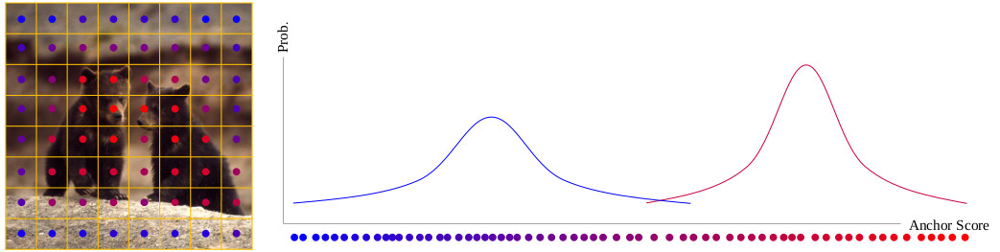
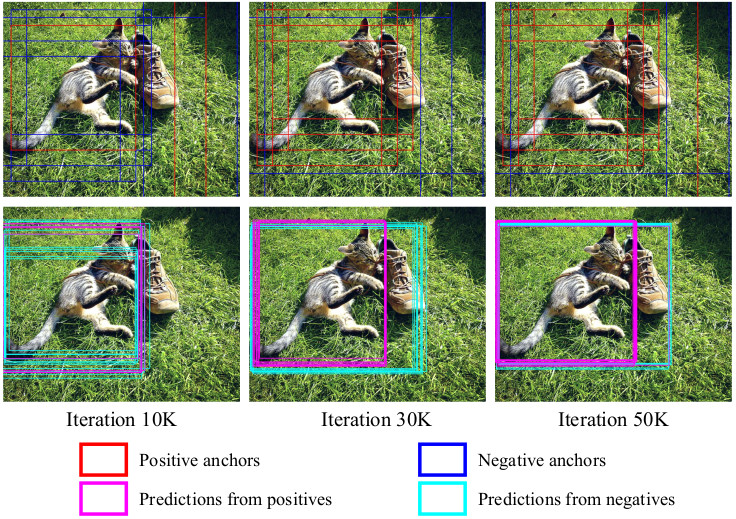

# Probabilistic Anchor Assignment with IoU Prediction for Object Detection

By Kang Kim and Hee Seok Lee.

This is a PyTorch implementation of the paper `Probabilistic Anchor Assignment with IoU Prediction for Object Detection` ([paper link](https://arxiv.org/abs/2007.08103)), based on [ATSS](https://github.com/sfzhang15/ATSS) and [maskrcnn-benchmark](https://github.com/facebookresearch/maskrcnn-benchmark).

## Note
Now the code supports **PyTorch 1.6**.

PAA is available at [mmdetection](https://github.com/open-mmlab/mmdetection/tree/master/configs/paa). Many thanks to [@jshilong](https://github.com/jshilong) for the great work!

## Introduction
In object detection, determining which anchors to assign as positive or negative samples, known as __anchor assignment__, has been revealed as a core procedure that can significantly affect a model's performance. In this paper we propose a novel anchor assignment strategy that adaptively separates anchors into positive and negative samples for a ground truth bounding box according to the model's learning status such that it is able to reason about the separation in a probabilistic manner. To do so we first calculate the scores of anchors conditioned on the model and fit a probability distribution to these scores. The model is then trained with anchors separated into positive and negative samples according to their probabilities. Moreover, we investigate the gap between the training and testing objectives and propose to predict the Intersection-over-Unions of detected boxes as a measure of localization quality to reduce the discrepancy.
<div align="center">
  
</div>
<div align="center">
  
</div>

## Installation
Please check [INSTALL.md](INSTALL.md) for installation instructions.

## Inference
The inference command line on coco minival split:

    python tools/test_net.py \
        --config-file configs/paa/paa_R_50_FPN_1x.yaml \
        MODEL.WEIGHT [/path/to/weight] \
        TEST.IMS_PER_BATCH 4    

Please note that:
1) If your model's name is different, please replace `PAA_R_50_FPN_1x.pth` with your own.
2) If you enounter out-of-memory error, please try to reduce `TEST.IMS_PER_BATCH` to 1.
3) If you want to evaluate a different model, please change `--config-file` to its config file (in [configs/paa](configs/paa)) and `MODEL.WEIGHT` to its weights file.

## Results on COCO
We provide the performance of the following trained models. All models are trained with the configuration same as [ATSS](https://github.com/sfzhang15/ATSS).

Model | Multi-scale training | Multi-scale testing | AP (minival) | AP (test-dev) | Checkpoint
--- |:---:|:---:|:---:|:---:|:---:
PAA_R_50_FPN_1x | No | No | 40.4 | - | -
PAA_R_50_FPN_1.5x | No | No | 41.1 | 41.2 | [link](https://drive.google.com/file/d/1i8i38lCkItS7H2gYN20Om_OyNJeAupoC/view?usp=sharing)
PAA_R_101_FPN_2x | Yes | No | 44.5 | 44.8 | [link](https://drive.google.com/file/d/1XGomiYsB-vHKs4eIw_OtgByJ2YJn-Hsc/view?usp=sharing)
PAA_dcnv2_R_101_FPN_2x | Yes | No | 47.0 | 47.4 | -
PAA_X_101_64x4d_FPN_2x | Yes | No | 46.3 | 46.6 | -
PAA_dcnv2_X_101_64x4d_FPN_2x | Yes | No | 48.8 | 49.0 | -
PAA_dcnv2_X_101_32x8d_FPN_2x | Yes | No | 48.9 | 49.0 | -
PAA_dcnv2_X_152_32x8d_FPN_2x | Yes | No | 50.5 | 50.8 | [link](https://drive.google.com/file/d/1CjsgE_faZFcpLRHvF7r6GFVC8AL3sZ_4/view?usp=sharing)
PAA_dcnv2_X_101_64x4d_FPN_2x | Yes | Yes | 51.2 | 51.4 | -
PAA_dcnv2_X_101_32x8d_FPN_2x | Yes | Yes | 51.2 | 51.4 | -
PAA_dcnv2_X_152_32x8d_FPN_2x | Yes | Yes | 53.0 | 53.5 | [link](https://drive.google.com/file/d/1CjsgE_faZFcpLRHvF7r6GFVC8AL3sZ_4/view?usp=sharing)

[1] *1x , 1.5x and 2x mean the model is trained for 90K, 135K and 180K iterations, respectively.* \
[2] *All results are obtained with a single model.* \
[3] *`dcnv2` denotes deformable convolutional networks v2. Note that for ResNet based models, we apply deformable convolutions from stage c3 to c5 in backbones. For ResNeXt based models only stage c4 and c5 use deformable convolutions. All dcnv2 models use deformable convolutions in the last layer of detector towers.* \
[4] *Please use `TEST.BBOX_AUG.ENABLED True` to enable multi-scale testing.*

### Results of Faster R-CNN
We also provide experimental results that apply PAA to Region Proposal Network of Faster R-CNN. Code will be available soon.

Model | AP (minival) | AP50 | AP75 | APs | APm | APl
--- |:---:|:---:|:---:|:---:|:---:|:---:
Faster_R_50_FPN_1x | 37.989 | 58.810 | 41.314 | 22.361 | 41.522 | 49.584
Faster_R_50_FPN_PAA_1x | 39.292 | 60.019 | 42.567 | 22.650 | 43.170 | 51.875

## Training

The following command line will train PAA_R_50_FPN_1x on 8 GPUs with Synchronous Stochastic Gradient Descent (SGD):

    python -m torch.distributed.launch \
        --nproc_per_node=8 \
        --master_port=$((RANDOM + 10000)) \
        tools/train_net.py \
        --config-file configs/paa/paa_R_50_FPN_1x.yaml \
        DATALOADER.NUM_WORKERS 2 \
        OUTPUT_DIR training_dir/paa_R_50_FPN_1x
        
Please note that:
1) If you want to use fewer GPUs, please change `--nproc_per_node` to the number of GPUs. No other settings need to be changed. The total batch size does not depends on `nproc_per_node`. If you want to change the total batch size, please change `SOLVER.IMS_PER_BATCH` in [configs/paa/paa_R_50_FPN_1x.yaml](configs/paa/paa_R_50_FPN_1x.yaml).
2) The models will be saved into `OUTPUT_DIR`.
3) If you want to train PAA with other backbones, please change `--config-file`.

## Contributing to the project
Any pull requests or issues are welcome.

## Citation
```
@inproceedings{paa-eccv2020,
  title={Probabilistic Anchor Assignment with IoU Prediction for Object Detection},
  author={Kim, Kang and Lee, Hee Seok},
  booktitle = {ECCV},
  year={2020}
}
```
